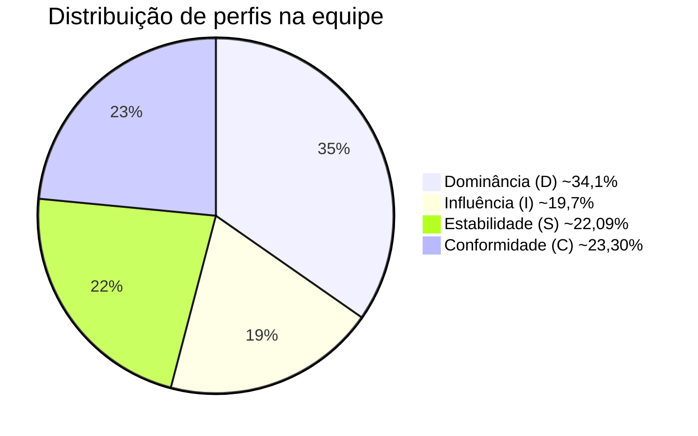

## Metodologia de Avaliação

1. Cada membro completou individualmente o teste DISC online disponível em https://www.mrcoach.com.br/teste-perfil-comportamental-disc.php
2. Os perfis foram gerados automaticamente pela plataforma PACTORH
3. Os resultados foram consolidados e analisados em grupo
4. Padrões e complementaridades foram identificados

## Membros da Equipe e Seus Perfis

| Nome                 | Perfil Predominante | Dominância (D) | Influência (I) | Estabilidade (S) | Conformidade (C) |
|:--------------------|:-------------------:|:--------------:|:--------------:|:----------------:|:----------------:|
| Beatriz Auer         | C                   | 25%            | 12,50%         | 17,50%           | 45%              |
| João Marcos Pimentel | D                   | 43,90%         | **43,90%**     | 4,88%            | 7,32%            |
| Kleber André Lirio   | D                   | 35%            | 22,50%         | 17,50%           | 25%              |
| Lara Aguilar         | C                   | 0%             | 12,50%         | 42,50%           | **45%**          |
| Manoel Rodrigues     | I                   | 22,50%         | 42,50%         | 20%              | 15%              |
| Marcos Vinícius Santos | S                 | 25%            | 15%            | **47,50%**       | 12,50%           |
| Matheus Caldas       | S                   | 10%            | 30%            | 40%              | 20%              |
| Sofia de Alcantara   | D                   | **55%**        | 25%            | 2,50%            | 17,50%           |

## Análise Coletiva

### **Observações Atualizadas sobre a Dinâmica da Equipe**  

1. **Equilíbrio entre Ação e Análise, mas com Dominância (D) Mais Forte:**  
   - **João Marcos (D/I)** e **Sofia (D)** amplificam essa característica, criando um ambiente dinâmico, mas com risco de impaciência em processos mais lentos. 
   - **Kleber (D com traços de I e C)** pode ser um "mediador" natural entre os perfis mais extremos (ex.: entre Sofia [D puro] e Lara [C]).  

2. **Influência (I) Ainda Limitada:**  
   - **Manoel (I)** continua sendo o principal perfil de comunicação e persuasão, mas **Kleber (22,5% I)** e **João Marcos (43,9% I)** ajudam a compensar.  
   - Se a equipe precisar de mais engajamento externo ou brainstorming criativo, pode ser necessário estimular mais participação desses membros.  

3. **Conformidade (C) e Estabilidade (S) em Menor Peso, mas Críticos:**  
   - **Beatriz e Lara (C)** garantem precisão e atenção a detalhes, enquanto **Marcos Vinícius e Matheus (S)** trazem consistência.  
   - Como **D** é predominante, há risco de subvalorizar processos meticulosos. Uma sugestão é **designar momentos específicos para análise e demais eventos mais metódicos**.  

4. **Sugestões para Melhorar a Sinergia:**  
   - **Evitar conflitos entre D e C:** Criar um fluxo onde **D** propõe soluções rápidas e **C** as refine, em vez de debates abertos (que podem gerar atritos).   
   - **Balancear tomadas de decisão:** Incluir **S** e **C** em fases de planejamento, enquanto **D** e **I** atuam mais na execução.  

### **Conclusão**  
A equipe tem **alta capacidade executiva (D)** e **boa análise crítica (C)**, mas precisa de:  
- **Mais estímulo à comunicação (I)** para evitar viés "só ação".  
- **Processos claros** para harmonizar perfis opostos (ex.: **D** vs. **C**).  
- **Uso estratégico de perfis híbridos** (Kleber, João Marcos) como ponte entre extremos.  