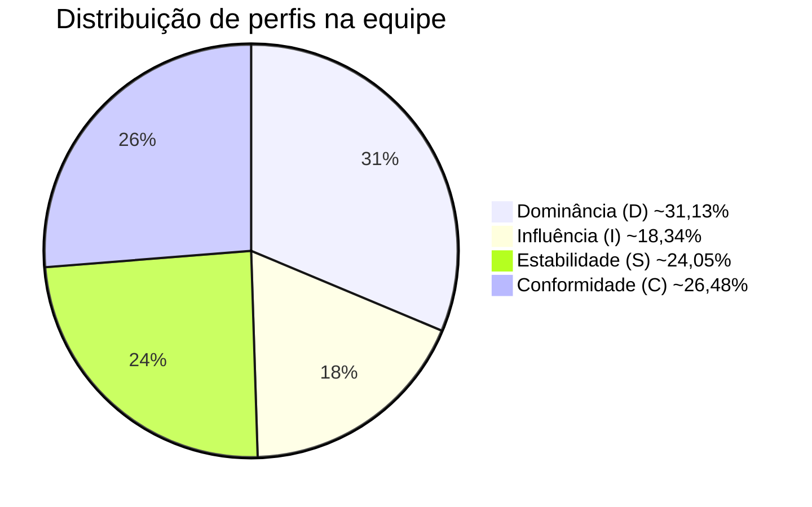

## Metodologia de Avaliação

1. Cada membro completou individualmente o teste DISC online disponível em https://www.mrcoach.com.br/teste-perfil-comportamental-disc.php
2. Os perfis foram gerados automaticamente pela plataforma PACTORH
3. Os resultados foram consolidados e analisados em grupo
4. Padrões e complementaridades foram identificados

## Membros da Equipe e Seus Perfis

### Beatriz Auer 
**Perfil DISC predominante:** [C]  
**Pontuações:**
- Dominância (D): [25]%
- Influência (I): [12,50]%
- Estabilidade (S): [17,50]%
- Conformidade (C): [45]%

### João Marcos Pimentel
**Perfil DISC predominante:** [D]  
**Pontuações:**
- Dominância (D): [43,90]%
- Influência (I): [43,90]%
- Estabilidade (S): [4,88]%
- Conformidade (C): [7,32]%

### Kleber André Lirio
**Perfil DISC predominante:** [D]  
**Pontuações:**
- Dominância (D): [X]%
- Influência (I): [X]%
- Estabilidade (S): [X]%
- Conformidade (C): [X]%
  
### Lara Aguilar
**Perfil DISC predominante:** [C]  
**Pontuações:**
- Dominância (D): [0]%
- Influência (I): [12,50]%
- Estabilidade (S): [42,50]%
- Conformidade (C): [45]%
  
### Manoel Rodrigues
**Perfil DISC predominante:** [I]  
**Pontuações:**
- Dominância (D): [22,50]%
- Influência (I): [42,50]%
- Estabilidade (S): [20]%
- Conformidade (C): [15]%

### Marcos Vinícius Santos
**Perfil DISC predominante:** [S]  
**Pontuações:**
- Dominância (D): [25]%
- Influência (I): [15]%
- Estabilidade (S): [47,50]%
- Conformidade (C): [12,50]%

### Matheus Caldas
**Perfil DISC predominante:** [S]  
**Pontuações:**
- Dominância (D): [10]%
- Influência (I): [30]%
- Estabilidade (S): [40]%
- Conformidade (C): [20]%

### Sofia de Alcantara
**Perfil DISC predominante:** [D]  
**Pontuações:**
- Dominância (D): [55]%
- Influência (I): [25]%
- Estabilidade (S): [2,50]%
- Conformidade (C): [17,50]%

## Análise Coletiva

**Observações sobre a dinâmica da equipe:**
1. [Primeira observação sobre como os perfis se complementam]
2. [Segunda observação sobre potenciais pontos de atenção]
3. [Sugestão para melhor aproveitamento das diversidades comportamentais]