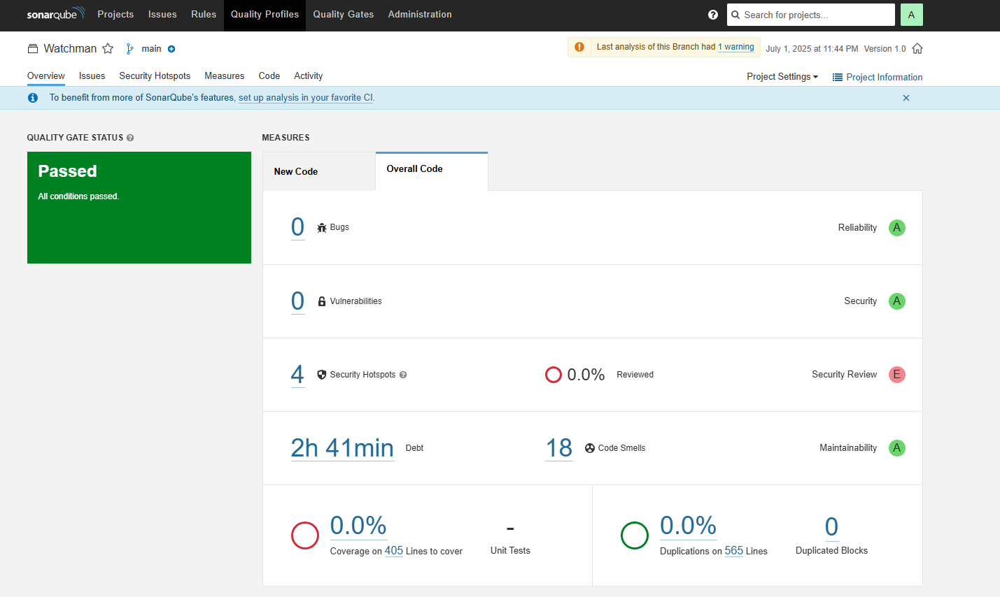
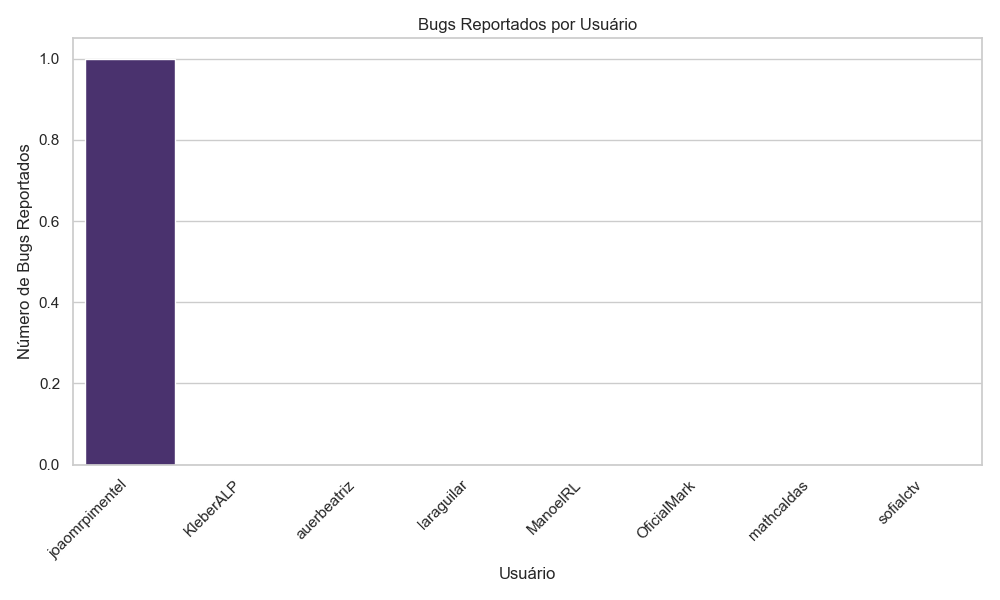
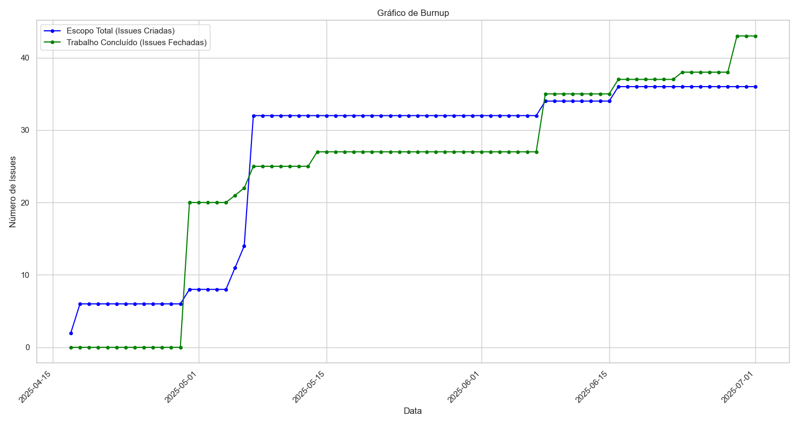
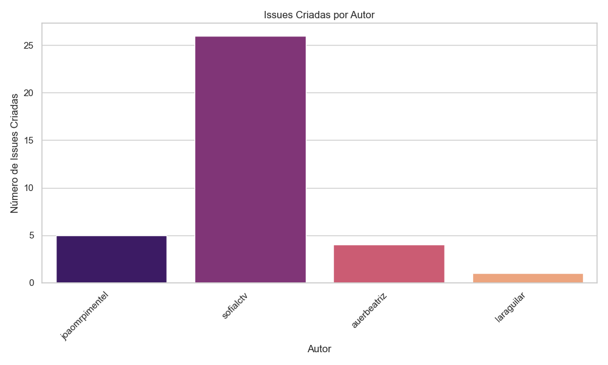
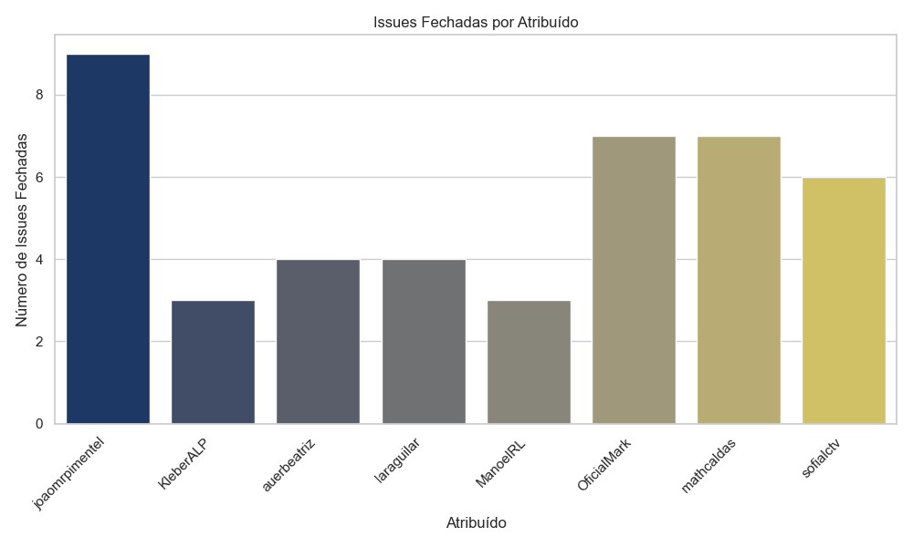
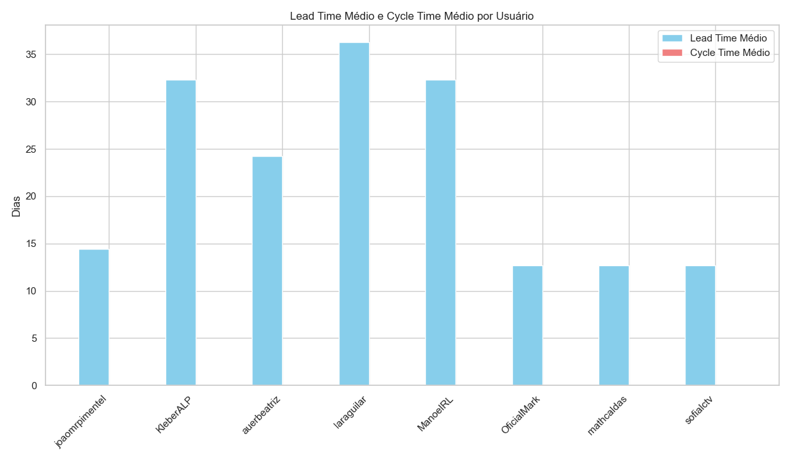
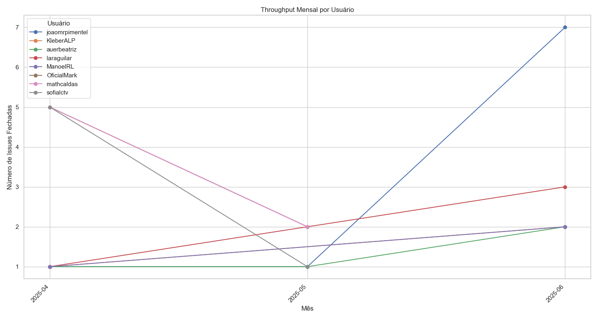
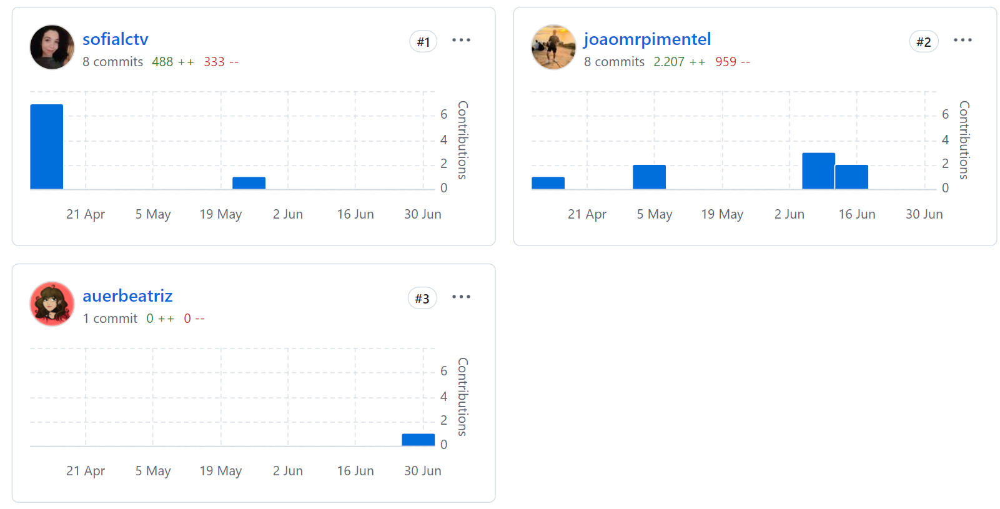

# Resultados Finais

# Comunicação entre os times
- Estabelecer comunicação com os alunos de DOO foi muito difícil.
- Devido a baixa participação do grupo, optamos por **não enviar** um formulário de Feedback, decisão compartilhada com o prof. durante Entrevista 1. 

# Gestão de Tarefas
- Utilizamos o GitHub Projects para controle de tarefas (veja nosso backlog aqui [aqui](https://github.com/users/joaomrpimentel/projects/1/views/1)).
- Combinamos que o grupo de DOO ficaria responsável por atualizar o status das tarefas.

# SonarQube
Tentativa de estrutruar o Sonar foi falha.

# Métricas 
## Desempenho Individual

### joaomrpimentel
- **Lead Time:** 14,44 dias  
- **Bugs:** 1 reportado  
- **Entregas:**  
  ▸ Abril: 1  
  ▸ Maio: 1  
  ▸ Junho: 7 *(+600% vs maio)*  
- **Total issues:** 9  

### KleberALP
- **Lead Time:** 32,33 dias *(acima da média)*  
- **Entregas:**  
  ▸ Abril: 1  
  ▸ Junho: 2  
- **Total issues:** 3  

### auerbeatriz
- **Lead Time:** 24,25 dias  
- **Entregas:**  
  ▸ Abril: 1  
  ▸ Maio: 1  
  ▸ Junho: 2  
- **Total issues:** 4  

### laraguilar
- **Lead Time:** 36,25 dias *(maior valor)*  
- **Entregas:**  
  ▸ Abril: 1  
  ▸ Junho: 3  
- **Total issues:** 4  

### ManoelRL
- **Lead Time:** 32,33 dias  
- **Entregas:**  
  ▸ Abril: 1  
  ▸ Junho: 2  
- **Total issues:** 3  

## Análise Comparativa

### Lead Time Médio
| Desenvolvedor   | Dias  |
|----------------|-------|
| joaomrpimentel | 14,44 |
| auerbeatriz    | 24,25 |
| KleberALP      | 32,33 |
| ManoelRL       | 32,33 |
| laraguilar     | 36,25 |

### Throughput Total
| Desenvolvedor   | Entregas |
|----------------|---------|
| joaomrpimentel | 9       |
| auerbeatriz    | 4       |
| laraguilar     | 4       |
| KleberALP      | 3       |
| ManoelRL       | 3       |

## Time Gestão
| Membro       | Lead Time | Entregas |
|--------------|-----------|---------|
| OficialMark  | 12,71     | 7       |
| mathcaldas   | 12,71     | 7       |
| sofialctv    | 12,67     | 6       |

> **Observação:** sofialctv criou 72% das issues (26/36)

## Gráficos

## Insights
 - 3/5 devs com Lead Time >30 dias
 - Cycle Time não mensurado
 - Alta concentração na criação de issues (sofialctv)

# Participação por Commits

## Repositório `watchman` - Contributors (All time period)
